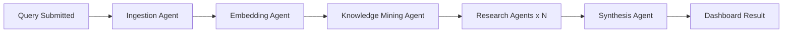

# EventForge — Product Requirements Document

> **Cursor agents:** Core context is in `.cursor/rules/eventforge-core.mdc` (always applied). This doc is deep product reference.

**Version:** 0.1 (MVP draft)  
**Last updated:** 2025-06-20  
**Status:** Phase 0 — Foundation

---

## 1. Vision

EventForge transforms open-ended research questions into structured, cited syntheses through a transparent, event-driven multi-agent pipeline. Users see *how* their answer was built — not just the answer — via a live workflow visualization.

### Problem

- Single-shot LLM queries lack depth, provenance, and parallel exploration.
- Multi-agent systems are often opaque black boxes with no observability.
- Portfolio projects rarely demonstrate real distributed systems patterns.

### Solution

A decoupled agent pipeline orchestrated by cloud events, with a polished dashboard showing pipeline state, costs, and synthesized research output.

---

## 2. Target Users

| Persona | Need |
|---------|------|
| **Researcher / analyst** | Deep, multi-source synthesis on a topic with citations |
| **Engineering hiring manager** | Evidence of production architecture skills |
| **Developer (self)** | Portfolio piece demonstrating full-stack + cloud + AI |

---

## 3. User Stories

### Epic A — Submit & Track Research

| ID | Story | Priority |
|----|-------|----------|
| US-A1 | As a user, I can submit a research query (topic + optional constraints) so the system begins investigation. | P0 |
| US-A2 | As a user, I can see real-time pipeline progress (which agent is running, completed stages) on a React Flow diagram. | P0 |
| US-A3 | As a user, I can view the final synthesis with sections, key findings, and source references. | P0 |
| US-A4 | As a user, I can see estimated LLM cost for my query. | P1 |
| US-A5 | As a user, I can view history of past queries and re-open results. | P1 |

### Epic B — Pipeline Reliability

| ID | Story | Priority |
|----|-------|----------|
| US-B1 | As the system, failed agent steps retry with exponential backoff before routing to DLQ. | P0 |
| US-B2 | As the system, duplicate events are ignored (idempotent processing). | P0 |
| US-B3 | As a developer, I can inspect failed jobs in DLQ and replay them. | P2 |

### Epic C — Authentication & Multi-tenancy

| ID | Story | Priority |
|----|-------|----------|
| US-C1 | As a user, I can sign in (Clerk) to persist my query history. | P1 |
| US-C2 | As a user, I can only see my own queries and results. | P1 |

### Epic D — Observability

| ID | Story | Priority |
|----|-------|----------|
| US-D1 | As a developer, every agent step emits OTEL traces with correlation_id. | P1 |
| US-D2 | As a developer, structured logs include job_id, agent_name, duration, token_count. | P1 |

---

## 4. Agent Pipeline (MVP)

| Agent | Responsibility |
|-------|----------------|
| **Ingestion** | Parse query, fetch initial sources (web/API), normalize documents |
| **Embedding** | Chunk documents, generate embeddings, store in Postgres (pgvector) |
| **Knowledge Mining** | Retrieve relevant chunks, extract entities, build knowledge graph edges |
| **Research (parallel)** | Spawn N focused sub-queries; each agent researches one angle |
| **Synthesis** | Merge research outputs into structured report with citations |

---

## 5. Functional Requirements

### 5.1 Query Submission (P0)

- Accept: `topic` (required), `depth` (quick/standard/deep), `max_sources` (optional)
- Return: `job_id`, `correlation_id`
- Emit: `eventforge.query.submitted`

### 5.2 Live Status (P0)

- WebSocket or SSE endpoint streaming pipeline events
- React Flow nodes update: `pending → running → completed | failed`
- Show per-stage duration and agent name

### 5.3 Results Dashboard (P0)

- Markdown-rendered synthesis
- Expandable source list with URLs/snippets
- Export as Markdown (P2: PDF)

### 5.4 Cost Tracking (P1)

- Record per-call: model, input_tokens, output_tokens, estimated_cost_usd
- Aggregate per job; display in UI

---

## 6. Non-Functional Requirements

| Category | Requirement |
|----------|-------------|
| **Latency** | First status update < 2s; full pipeline < 5 min (standard depth) |
| **Availability** | 99.5% API uptime (prod target) |
| **Scalability** | Research agents scale horizontally via SQS consumer count |
| **Security** | Auth on all mutating endpoints; RLS or user_id scoping on data |
| **Observability** | Distributed tracing across all agents; correlation_id in every log |
| **Cost** | Hard cap per query configurable; alert if exceeded |
| **Resilience** | DLQ for all queues; Step Functions catch/retry policies |

---

## 7. Success Criteria

### MVP Launch

- [ ] End-to-end query → synthesis works locally via Docker Compose
- [ ] React Flow shows live pipeline state
- [ ] At least 3 parallel research agents execute
- [ ] Failed step retries then lands in DLQ
- [ ] OTEL traces visible in local collector
- [ ] Deployed to AWS dev environment via Terraform

### Portfolio Impact

- [ ] Architecture diagram and ADRs documented
- [ ] Demo video / screenshots of live workflow
- [ ] README with clear "how it works" section
- [ ] Cost-per-query visible in UI

---

## 8. MVP vs Future Scope

### MVP (Phases 0–4)

- Single-user auth (Clerk)
- Web search ingestion (Tavily or SerpAPI)
- Postgres + pgvector for embeddings and metadata
- 3–5 parallel research agents
- EventBridge + SQS orchestration
- Step Functions for research fan-out
- Basic cost tracking
- Terraform dev environment

### Future (Post-MVP)

| Feature | Notes |
|---------|-------|
| PDF / document upload ingestion | S3 + Textract |
| Custom knowledge bases | User-uploaded corpora |
| Dedicated vector DB (Qdrant) | If pgvector ANN limits hit at scale |
| Temporal migration | If Step Functions limits hit |
| Team workspaces | Multi-tenant org model |
| Scheduled research | Cron-triggered recurring queries |
| Graph visualization | Knowledge graph beyond React Flow pipeline |
| Human-in-the-loop | Pause pipeline for user approval mid-flow |
| Linear bi-directional sync | Auto-update TASKS.md from issue status |

---

## 9. Out of Scope (MVP)

- Mobile native apps
- Real-time collaborative editing
- Fine-tuned custom models
- Multi-region active-active deployment

---

## 10. Open Questions

| # | Question | Default Assumption |
|---|----------|-------------------|
| 1 | Web search provider? | Tavily API (research-focused) |
| 2 | Auth provider? | Clerk |
| 3 | Step Functions vs pure SQS chaining? | Step Functions for fan-out; SQS for stage workers |
| 4 | Real-time transport? | SSE (simpler); WebSocket if bidirectional needed |
| 5 | Project name final? | EventForge (repo: event-driven) |

---

## 11. Metrics

| Metric | Target |
|--------|--------|
| Query completion rate | > 95% |
| P95 pipeline duration (standard) | < 4 min |
| Avg cost per standard query | < $0.50 |
| Failed messages in DLQ | < 1% of total |
